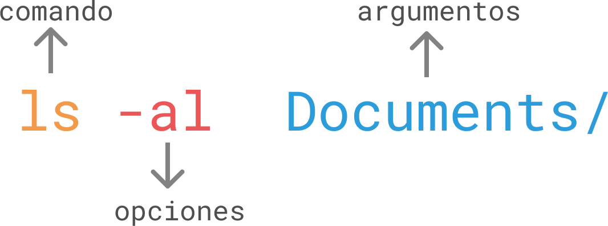

<!-- Otra forma de poner h1 -->
<!-- 1.Git y terminal (Estructura tu sitio)
=============== -->
# 1. Git y terminal (Estructura tu sitio)

### ¿Qué es Desarrollo Front-end?

Se encarga de programar el lado del cliente (navegador) de una web. **[Explicacion detallada](https://medium.com/@ivandevp/92659a91434f)**

### Emulador de terminal
Un emulador de terminal es una aplicación que permite virtualizar un intérprete de comandos pero dentro de la propia interfaz gráfica.

#### Anatomia de un comando

Todos los comandos se componen de:

- Un nombre con el que se invoca el comando
- Opciones que modifican el comportamiento del comando. (Son opcionales).
- Argumentos sobre los que actúa el comando. (También opcionales).



#### Comandos

- **man:** Nos muestra la definición de un comando y de los distintos atributos que se pueden usar. Para probarlo tan solo deberemos escribir `man [comando]` por ejemplo **`man ls`**.

- **help:**  Nos muestra la definición de un comando y de los distintos atributos que se pueden usar. Para probarlo tan solo deberemos escribir `man [comando]` por ejemplo **`man cd`** o **`help cd`**.

- **ls:** Si se ejecuta **`ls`** se listará la lista de archivos de la ruta en la cual se ejecutó el comando. Se puede usar de igual manera `ls [ruta]` para poder listar los archivos y carpetas de la ruta especificada por ejemplo **`ls carpeta1/carpeta2/carpeta3
`**

- **cd:** El comando cd sirve para cambiar de directorio. Para ir una carpeta mas adelante se usa `cd [ ruta ]` por ejemplo **`cd carpeta1`**. Para regresar a un nivel mas atras se usa **`cd ..`**

- **mkdir:** sirve para crear un nuevo directorio. `mkdir [ carpeta ]` o `mkdir [ directorio ]`. Ejemplo para crear directorio en la ruta en el que se ejecutó **`mkdir carpeta1`**. Se puede usar **`mkdir carpeta1/carpeta2/carpeta3`** en este caso se creara 'carpeta3' dentro de la ruta 'carpeta1/carpeta2/'.

- **touch:** sirve para crear un nuevo archivo vacío si este no existe. Se usa `touch [ archivoNuevo ]` o `touch [ ruta ] [ archivoNuevo ]`. Ejemplo **`touch index.html`**
o **`touch carpeta1/carpeta2/carpeta3/index.html`**.

- **rm:** borra algún archivo o directorio. Para archivos se usa `rm [ archivo ]` o `rm [ ruta ]  [ archivo ]`. Ejemplo **`rm index.html`** o **`rm carpeta1/carpeta2/carpeta3/index.html`**. Para directorios se usa `rm -r [ directorio ]` o `rm -r [ ruta ] [ directorio ]` por ejemplo
**`rm -r carpeta1`** o **`rm -r carpeta1/carpeta2/carpeta3
`** borraria 'carpeta3'.

- **cp:** sirve para copiar archivos o directorios. Se usa
`cp [ ruta Origen ] [ archivo ] [ ruta Destino ]`. Para un archivo se usa por ejemplo **`cp carpeta1/carpeta2/carpeta3/index.html carpeta1/carpeta2`** para un directorio se usa **`cp -r carpeta1/carpeta2/carpeta3 carpeta1`** este comando copiara el directorio 'carpeta3' en 'carpeta1'.

- **mv:** Para mover un directorio o archivo. Este comando es igual que copiar a diferencia que el archivo o directorio de destino se elimina. Se usa `mv [ ruta Origen ] [ archivo ] [ ruta Destino ]`. Por ejemplo para mover un archivo **`mv carpeta1/carpeta2/carpeta3/index.html carpeta1`**. Para un directorio **`mv carpeta1/carpeta2/carpeta3 carpeta1`**. Nota: para mover un directorio no se usa `-r` a diferencia de **cp** que es necesario usar `-r`.

- **cat:** Ver el contenido de un archivo, simplemente nos muestra su contenido sin posibilidad de cambiarlo se usa `cat [ archivo ]`. Por ejemplo:
**`cat carpeta1/carpeta2/carpeta3/index.html`**

- **pwd:** nos muestra el directorio en el cual estamos

### Git

Git es un sistema de control de versiones, esto quiere decir que te permite mantener un historial de cambios y que puedas ver los cambios realizados en cualquier momento.

#### Flujo de trabajo de git


#### Comandos de GIT
- **git init:** inicia un proyecto de git. Ejemplo **`git init`** inicia el repositorio en el directorio en el que estemos.

- **git add:** agrega archivos al index. Ejemplo **`git add .`** agrega todos los archivos o **`git add index.html`** agrega solo el archivo index.html.

- **git commit:** realizar un commit (una instantánea de tu código). Ejemplo **`git commit -m "Mis cambios realizados"`**

- **git config:** configura la identidad de quien realiza un commit (nombre de usuario y dirección de correo electrónico). Ejemplo: **`git config --global user.email luis_daniel.grra15@hotmail.com'`** configura el correo de identidad o **`git config --global user.name 'DanyGuerra'`** configura el nombre de identidad

- **git remote add origin:** agrega un repositorio remoto al proyecto. Ejemplo **`git remote add origin https://github.com/DanyGuerra/nombre-del-repositorio.git`**

- **git push:** envía un commit al servidor. Ejemplo **`git push -u origin main`** en caso de crear una nueva rama y querer enviarla al servidor usamos **`git push -u origin nueva-rama`**

- **git push (Borrar ramas remotas):** en caso de que una rama este en el servidor y queramos eliminarla se usa el comando **`git push origin :nueva-rama`**. De esta manera se eliminara la rama remota.

- **git clone:** descarga un repositorio remoto. Ejemplo **`git clone https://github.com/DanyGuerra/nombre-del-repositorio.git`** clona el repositorio remoto en el directorio donde se ejecute el comando.

- **git checkout:** cambia de rama. Ejemplo **`git checkout nueva-rama`** nos cambia a la rama 'nueva-rama'. Tambien podemos usar **`git checkout -b rama-desarrollo`** este comando crea la rama 'rama-desarrollo' y nos cambia a ella.

- **git branch:** enlista las ramas / crea una rama. Por ejemplo **`git branch`** enlista las ramas que existen y nos muestra en que rama estamos actualmente o **`git branch nueva-rama`** crea la rama llamada 'nueva-rama'.

- **git branch (Borrar ramas locales):** ejemplo **`git branch -d nueva-rama`** esto borrara localmente la rama. Debemos asegurarnos de no estar en la rama la cual queremos eliminar. El comando anterior solo funciona si la rama que queremos eliminar esta fusionada, de no estarlo no podremos eliminarla. En caso de que queramos eliminar una rama sin haberla fusionado debemos de usar el siguiente comando **`git branch -D rama-desarrollo`** esto forzara la eliminacion de la rama aunque no este fusionada.

- **git merge:** mezcla dos ramas. Ejemplo, primero debemos de cambiar a la rama a la cual se le quiera aplicar los cambios en este ejemplo se desea mezclar los cambios que se realizaron en 'rama-desarrollo' con la rama 'main'. Para esto nos aseguramos de estar en la rama 'main' con `git checkout main` despues ejecutamos **`git merge rama-desarrollo`** con esto se mezclara la 'rama-desarrollo' con la rama 'main'. Esto nos permite, por ejemplo hacer, cambios de diseño en 'rama-desarrollo' sin afectar el funcionamiento de la rama 'main' y una vez que se este seguro de que los cambios en 'rama-desarrollo' funcionan de manera correcta se mezclan los cambios con 'main' como en el ejemplo.

- **git pull:** descarga y aplica los cambios de una rama remota a una rama local.

- **git diff:** muestra los cambios entre dos commits o dos ramas.

- **git status:** muestra el estado actual del proyecto.

- **git log:** muestra el historial de commits de una rama.

- **git fetch:** descarga los cambios de una rama remota, pero no los aplica.

#### Iniciar repositorio con Git
1. **`git init`**
2. **`git add .`**
3. **`git config --global user.email 'you@email.com'`**
4. **`git config --global user.name 'Your name'`**
5. **`git commit -m "Mi primer commit en Git"`**
6. **`git remote add origin https://github.com/DanyGuerra/repositorio-vacio.git`**
7. **`git push -u origin main`**


### GitHub
Sistema de gestión de proyectos y control de versiones de código, así como una plataforma de red social diseñada para desarrolladores

#### Github Pages
Servicio de Github que permite publicar un repositorio como si fuera un sitio web.

### HTML
HTML **(HyperText Markup Language)** es un lenguaje de marcado que nos permite expresar al navegador web (programa que usamos para navegar en internet, ejemplo: Internet Explorer, Google Chrome, Mozilla Firefox, Safari, etc) lo que queremos que se muestre a través de una sintaxis basada en etiquetas.

#### Etiquetas HTML
Son fragmentos de código que permiten crear elementos HTML, estructuras básicas del lenguaje de programación HTML en el que se escriben las páginas web porque es el que entienden los navegadores.

El formato de una etiqueta HTML es un fragmento de texto encerrado entre corchetes angulares < >, y cada elemento HTML tiene una etiqueta de inicio del tipo `<etiqueta>` y suele terminar con una etiqueta de cierre que lleva una barra inclinada al principio `</etiqueta>`.

Los elementos HTML tienen dos propiedades básicas:

- Atributos, que se encuentran en la etiqueta de inicio
- Contenido, ubicado entre las dos etiquetas


### CSS (Cascading Style Sheets)
Es un lenguaje de estilos que nos permite personalizar la apariencia de los elementos que hemos agregado en nuestro HTML.

Los estilos se aplican a través de selectores, que es una sintaxis particular para saber qué elemento queremos personalizar su apariencia.

La sintaxis es la siguiente:
```
selector{
    nombre-propiedad: valor-propiedad;
}

/*Ejemplo*/

body{
    background-color: red;
}
```


### [Menu](../README.md)
### [Siguiente](../sesion2)


