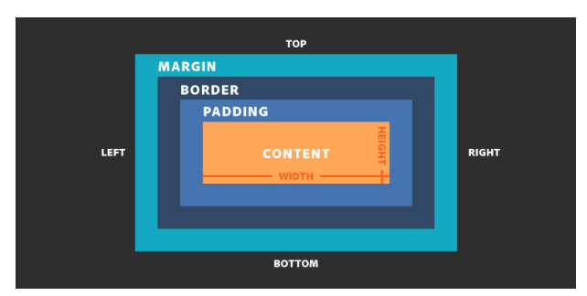

# 2. HTML5 y CSS3 (Agregando barra de navegación)
## Etiquetas semanticas de HTML
[Lista de Elementos HTML5(Documentacion)](https://developer.mozilla.org/es/docs/conflicting/Web/HTML/Element#secciones)

- `<!DOCTYPE html>`: indica al navegador web la versión de HTML que usarás (HTML 5)


 - `<html>`: indica el punto de partida de la página

- `<head>`: contiene toda la información relevante del sitio web pero que no se muestran como tal.

  - `<meta>`: meta de "metainformation" - metainformación. Sirve para aportar información sobre el documento

  - `<link>`: especifica la relación entre el documento actual y un recurso externo. Los usos posibles de este elemento incluyen la definición de un marco relacional para navegación. Este elemento es más frecuentemente usado para enlazar hojas de estilos.

  - `<title>`: indica cuál es el título que el navegador debe mostrar cuando un usuario este navegando en nuestro sitio web.

- `<body>`: delimita todo el contenido de la página web

- `<form>`: punto de partida de un formulario

## Modelo de Caja
[Documentacion](https://developer.mozilla.org/es/docs/Learn/CSS/Building_blocks/The_box_model)


El modelo de caja hace referencia a que cada elemento de HTML que vemos en la página web al final es una caja rectangular, así le pongamos a un botón bordes redondeados, internamente sigue siendo un rectángulo, los textos, imágenes y absolutamente todas las etiquetas se representan internamente como una caja rectangular.




### Modelo de cajas estandar

En el modelo de cajas estándar, cuando estableces los atributos `width` y `height` para una caja, defines el ancho y el alto del contenido de la caja. Cualquier área de relleno y borde se añade a ese ancho y alto para obtener el tamaño total que ocupa la caja. Esto se muestra en la imagen que encontrarás a continuación.

Ejemplo, se tienen las propidedades de CSS siguientes:

```
.box {
  width: 350px;
  height: 150px;
  margin: 10px;
  padding: 25px;
  border: 5px solid black;
}
```
El espacio que ocupa nuestra caja usando el modelo de cajas estándar será en realidad de 410 px (350 + 25 + 25 + 5 + 5); y su altura, de 210 px (150 + 25 + 25 + 5 + 5), porque el área de relleno y el borde se añaden al ancho que se utiliza para el contenido de la caja.


### El modelo de cajas CSS alternativo

CSS introdujo un modelo de caja alternativo algún tiempo después del modelo de cajas estándar. Con este modelo, cualquier ancho es el ancho de la caja visible en la página, por lo tanto, el ancho del área de contenido es ese ancho menos el ancho para el relleno y el borde. El mismo CSS que hemos usado antes daría entonces el resultado siguiente (ancho = 350 px, altura = 150 px).


Por defecto, los navegadores usan el modelo de cajas estándar. Si deseas activar el modelo de cajas alternativo para un elemento, hazlo configurando box-sizing: border-box. Con ello, le dices al navegador que tome como el borde de la caja el área definida por cualquier tamaño que establezcas.

```
.box {
  box-sizing: border-box;
}
```

La propiedad box-sizing permite indicar qué propiedades intervienen para calcular el tamaño de la caja.

En este caso, usamos border-box que es uno de los más utilizados, y lo que indica es que si nosotros ponemos un width: 100px, pero ponemos un padding de 10px y un borde de 5px a cada lado, nuestra caja mantendrá el ancho de 100px pero el contenido se reducirá a 70px de ancho, restando cada uno de los paddings y borders de cada lado.

## Display block o inline

Los elementos con display: block; usan todo el ancho disponible de su contenedor, es decir, si nosotros creamos 4 etiquetas `<p></p>`, una seguida de la otra, vamos a ver que cada texto que pongamos se mostrará uno debajo de otro porque por defecto su ancho será del 100%. Mientras que los elementos con display: inline; usan solo el espacio necesario para mostrar su contenido.

- Algunos ejemplos de elementos con display block son: div, p, ul, h1, header, section, aside, nav, y muchos más.

- Y algunos ejemplos de elementos con display inline son: img, a, span, strong, entre otros.‌


### [Anterior](../sesion1)
### [Siguiente](../sesion3)

 <h1><a href="blank" link="https://coderbyte.com">Click here to go to Coderbyte</a></h1>