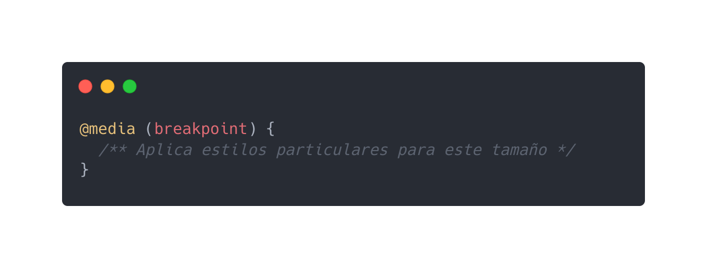

# 5. Responsive design (Adaptando a la vista desde un móvil)

## Diseño web adaptable

Con los usuarios de la web usando cada vez más dispositivos móviles para navegar sitios web y aplicaciones, los diseñadores y desarrolladores web necesitan asegurarse que sus creaciones se vean y funcionen bien tanto en dispositivos móviles como en equipos tradicionales de escritorio.

[Documnetacion MDN](https://developer.mozilla.org/es/docs/Desarrollo_Web/Web_adaptable)

[Responsive web design basics (Google)](https://web.dev/responsive-web-design-basics/)

### Media Queries

Una Media Query es una regla o conjunto de reglas que se introducen en una hoja de estilo CSS con el objetivo de definir propiedades específicas para distintos tipos de medios. Por ejemplo, con una Media Query podemos especificar el ancho y el alto de un contenido, de manera que este se adapte a los límites de una impresora sin tener que cambiar el contenido original.

Las Media Queries son fundamentales en el diseño web actual, ya que son la base del diseño responsive (responsivo o adaptable). Esto significa que con una misma maquetación HTML, nuestro diseño se adaptará a diferentes dispositivos y tipos de pantalla.

[Media Queries ejemplos](https://desafiohosting.com/que-es-una-media-query/)

[CSS tricks media queries](https://css-tricks.com/css-media-queries/)


- **Media queries:** característica que nos permite sobreescribir diferentes estilos en base a condiciones (breakpoints) que nosotros podemos definir.

- **Breakpoint:** condiciones que nosotros establecemos para que una media query se aplique, normalmente en base al ancho de un dispositivo.



Ejemplos de uso de media queries:

```css
/** dispositivos móviles en vista viewport (vertical) */
@media (max-width: 575px) {
}
/** dispositivos pequeños en vista landscape (horizontal) */
@media (min-width: 576px) and (max-width: 767px) {

}
/** dispositivos medianos (tablets) */
@media (min-width: 768px) and (max-width: 991px) {

}
/** dispositivos grandes (desktops) */
@media (min-width: 992px) and (max-width: 1199px) {

}
/** dispositivos extra grandes (monitores grandes, tvs) */
@media (min-width: 1200px) {

}
```

### Agregando meta viewport
HTML5 introdujo un método para permitir que los diseñadores web tomen el control de la ventana gráfica a través de la `<meta>` etiqueta.


Debe incluir el siguiente `<meta>` elemento de ventana gráfica en todas sus páginas web:

```html
<meta name="viewport" content="width=device-width, initial-scale=1.0">
```

Esto le da al navegador instrucciones sobre cómo controlar las dimensiones y la escala de la página.

- `width=device-width` establece el ancho de la página para seguir el ancho de la pantalla del dispositivo (que variará según el dispositivo).

- `initial-scale=1.0` establece el nivel de zoom inicial cuando el navegador carga la página por primera vez.

A continuación, se muestra un ejemplo de una página web sin la metaetiqueta de la ventana gráfica y la misma página web con la metaetiqueta de la ventana gráfica:

- Sin la metaetiqueta de la ventana gráfica


- Con la metaetiqueta de la ventana gráfica


[Documentacion viewport w3Schools](https://www.w3schools.com/css/css_rwd_viewport.asp)


### [Anterior](../sesion4)
### [Siguiente](../sesion6)