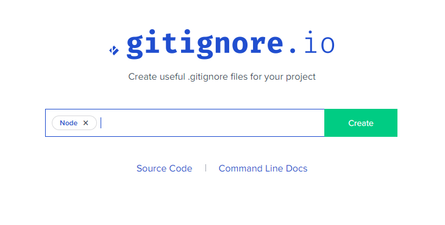

# 7. Preprocesadores de CSS (Optimizando la producción de CSS)

Un preprocesador CSS es un programa que te permite generar CSS a partir de la syntax (en-US) única del preprocesador. Existen varios preprocesadores CSS de los cuales escoger, sin embargo la mayoría de preprocesadores CSS añadiran algunas características que no existen en CSS puro, como variable, mixins, selectores anidados, entre otros. Estas características hacen la estructura de CSS más legible y fácil de mantener.

Preprocesadores mas utilizados:

- Sass

- Less

- Stylus

- PostCSS

En este proyecto se usara Saas para ello sera necesario tener instalado `node.js` para poder instalar sass mediande `npm` (Node Package Manager) ue tiene la función de proveer un comando en la terminal que te permite indicarle qué módulo escrito en JavaScript queremos usar en nuestro proyecto y él se encarga de buscarlo, descargarlo y ponerlo disponible para nosotros.

[Descargar e instalar Node.js](https://nodejs.org/es/)

### Intalacion de sass

Abrimos Git Bash en el proyecto en el cual instalaremos Sass y ejecutamos los siguientes comandos:

- `npm init` tendremos que contestar las preguntas que nos ira haciendo la terminal y despues de esto se generara el archivo de package.json

- `npm i sass` descarga los archivos de necesarios para usar sass. En el archivo package.json se agrego en dependencias la version que se usara de sass en este caso se agrego `"sass":"^1.34.5"` .

TIP: Si se quiere agregar otra version de sass se modifica esta linea en el archivo package.json, se elimina la carpeta que se creo al instalar sass (node_modules) y se ejecuta el comando `npm i` para que instale las dependencias enlistadas en package.json .

### Usando gitignore
En este punto ya tenemos las librerias agregadas al proyecto. Si ejecutamos  `git status` Git detectara que las librerias agregadas han modificado nuestro proyecto. Debido a que las librerias solo las usaremos para trabajar localmente y no queremos agregarlas al repositorio remoto se hara uso de **gitignore** . Para que Git ignore ciertos archivos como librerias y archivos que solo usaremos localmente se crea un archivo en el proyecto llamado .gitignore en donde escribiremos lo siguiente:

```

# Created by https://www.toptal.com/developers/gitignore/api/node
# Edit at https://www.toptal.com/developers/gitignore?templates=node

### Node ###
# Logs
logs
*.log
npm-debug.log*
yarn-debug.log*
yarn-error.log*
lerna-debug.log*
.pnpm-debug.log*

# Diagnostic reports (https://nodejs.org/api/report.html)
report.[0-9]*.[0-9]*.[0-9]*.[0-9]*.json

# Runtime data
pids
*.pid
*.seed
*.pid.lock

# Directory for instrumented libs generated by jscoverage/JSCover
lib-cov

# Coverage directory used by tools like istanbul
coverage
*.lcov

# nyc test coverage
.nyc_output

# Grunt intermediate storage (https://gruntjs.com/creating-plugins#storing-task-files)
.grunt

# Bower dependency directory (https://bower.io/)
bower_components

# node-waf configuration
.lock-wscript

# Compiled binary addons (https://nodejs.org/api/addons.html)
build/Release

# Dependency directories
node_modules/
jspm_packages/

# Snowpack dependency directory (https://snowpack.dev/)
web_modules/

# TypeScript cache
*.tsbuildinfo

# Optional npm cache directory
.npm

# Optional eslint cache
.eslintcache

# Microbundle cache
.rpt2_cache/
.rts2_cache_cjs/
.rts2_cache_es/
.rts2_cache_umd/

# Optional REPL history
.node_repl_history

# Output of 'npm pack'
*.tgz

# Yarn Integrity file
.yarn-integrity

# dotenv environment variables file
.env
.env.test
.env.production

# parcel-bundler cache (https://parceljs.org/)
.cache
.parcel-cache

# Next.js build output
.next
out

# Nuxt.js build / generate output
.nuxt
dist

# Gatsby files
.cache/
# Comment in the public line in if your project uses Gatsby and not Next.js
# https://nextjs.org/blog/next-9-1#public-directory-support
# public

# vuepress build output
.vuepress/dist

# Serverless directories
.serverless/

# FuseBox cache
.fusebox/

# DynamoDB Local files
.dynamodb/

# TernJS port file
.tern-port

# Stores VSCode versions used for testing VSCode extensions
.vscode-test

# yarn v2
.yarn/cache
.yarn/unplugged
.yarn/build-state.yml
.yarn/install-state.gz
.pnp.*

# End of https://www.toptal.com/developers/gitignore/api/node
```
Para poder generar el archivo anterior con todos los archivos que comunmente se ignoran se utilizo la pagina de [Toptal](https://www.toptal.com/developers/gitignore) en la cual generamos esta lista de paquetes a ignorar buscando *node*.



De esta manera al tener el archivo `.gitignore` todos los archivos que contenga estaran siendo ignorados por Git.

## Compilar sass a css
Se puede realizar esta accion de una manera manual para esto se puede hacer uso de la pagina [Beautifytools](https://beautifytools.com/scss-compiler.php), en donde podemos pegar el codigo sass que vayamos escribiendo y generar el archivo de css de manera manual.

Esta opcion manual es muy tediosa de estar realizando, por ello se puede realizar de manera automatica utilizando el siguiente comando:

- `./node_modules/sass/sass.js --watch ./scss/main.scss output.css`

Con el comando anterior estamos utilizando la dependencia de node  *sass.js* con el comando `--watch` estamos abriendo un escuchador el cual estara espereando que se realicen cambios en el archivo *sass* especificado *main.scss* y convirtiendolo a *css* en el archivo de `output.css`.

### [Anterior](../sesion6)
### [Siguiente](../sesion8)